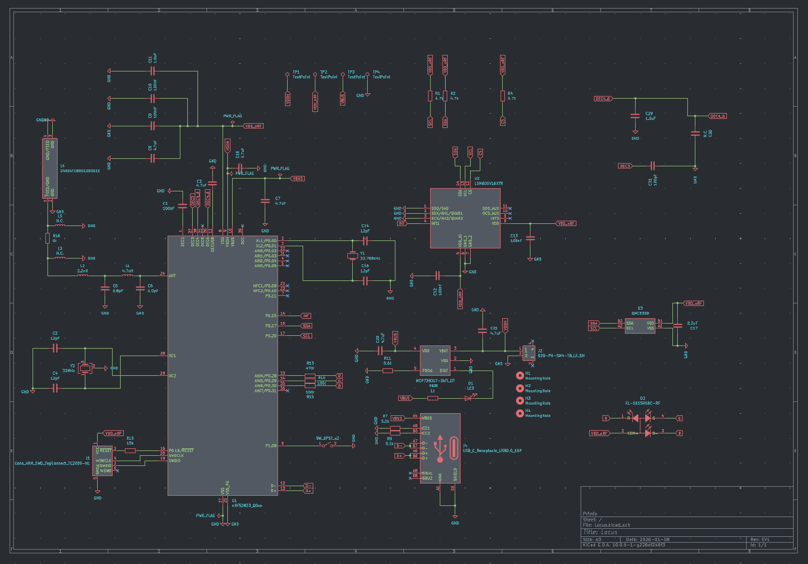
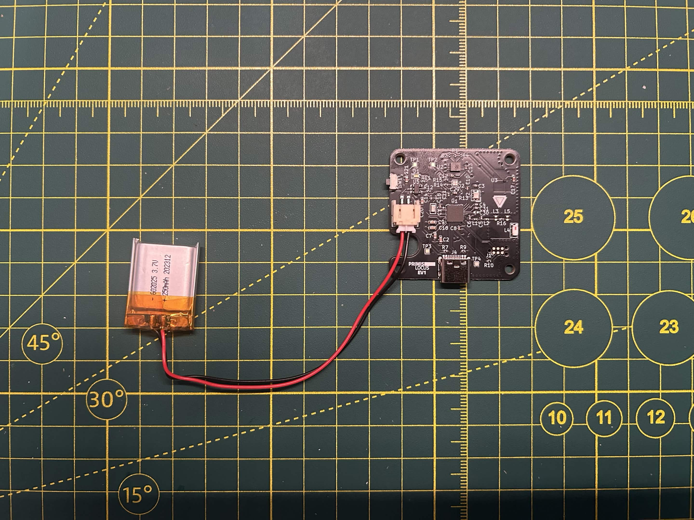

# Locus
Tracker for the Steam Frame.
## Current Isseus
Currently the SDA line is getting pulled 0.02v while running the slime firmware, if I halt the NRF52833 it jumps up to the expected 1.8v. Currently working on figuring out why this happens.

  

### Schematics

  

### PCB

  

### EV1

  

