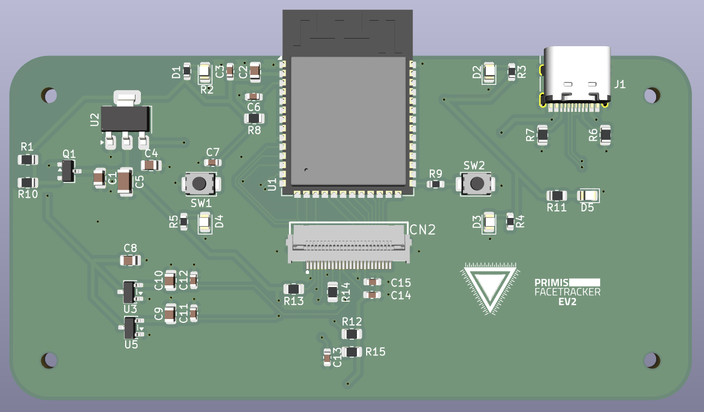
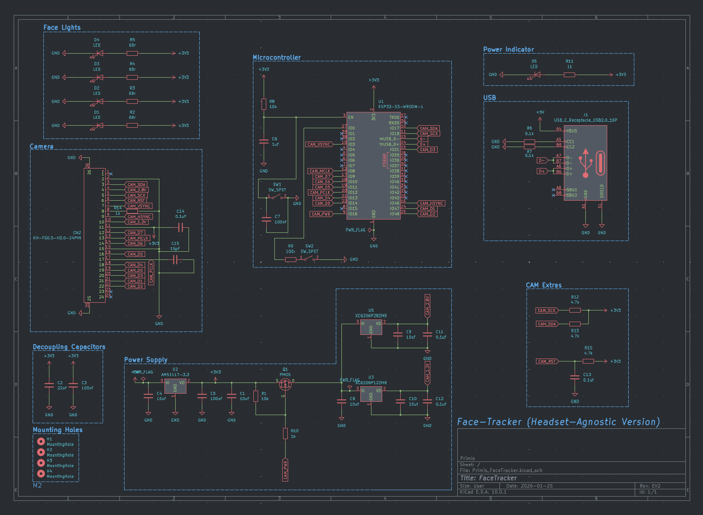
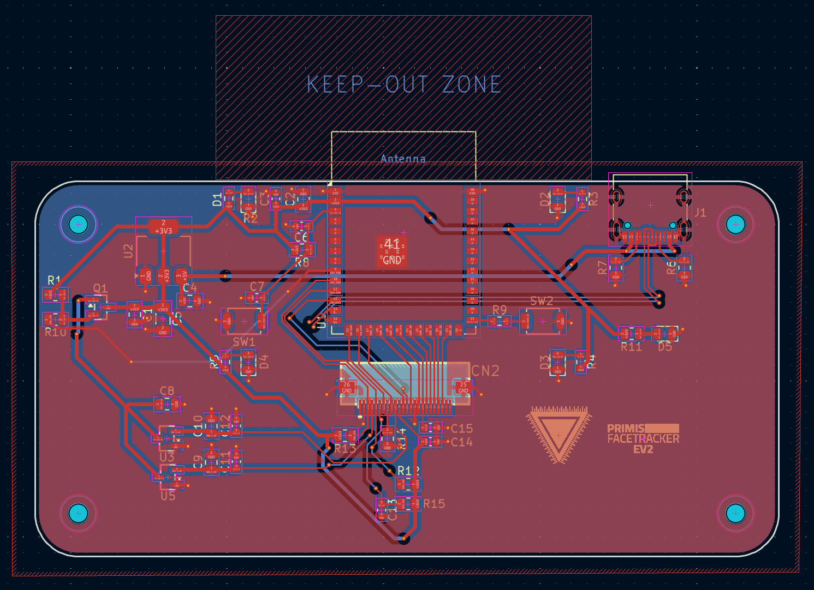
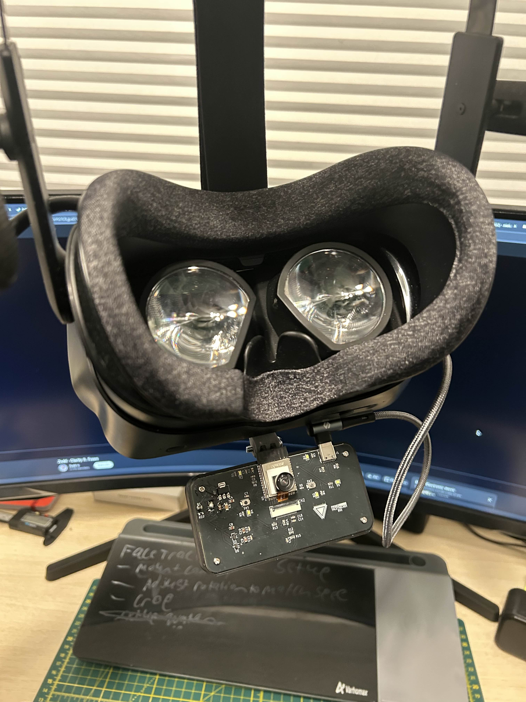

### WARNING
This has yet to be produced by me yet, I have not yet added the gerber files to this repo yet as I have no idea if it will work yet, order them at your own risk.
### TODO
* Copper pads under power supply
* Clean up and condense
* ESD Protection
# Face Tracker (Headset-Agnostic Version)
Headset-agnostic face tracker. Can be used with Frame by using the USB-C port on the battery.
## Current Isseus
Q1 is setup improperly, removing it and R10 as well as bridging the now empty pads solves the issue. Will fix in EV3 along with some changes to layout and LEDs.

  

### Schematics

  

### PCB

  

### EV2

  

