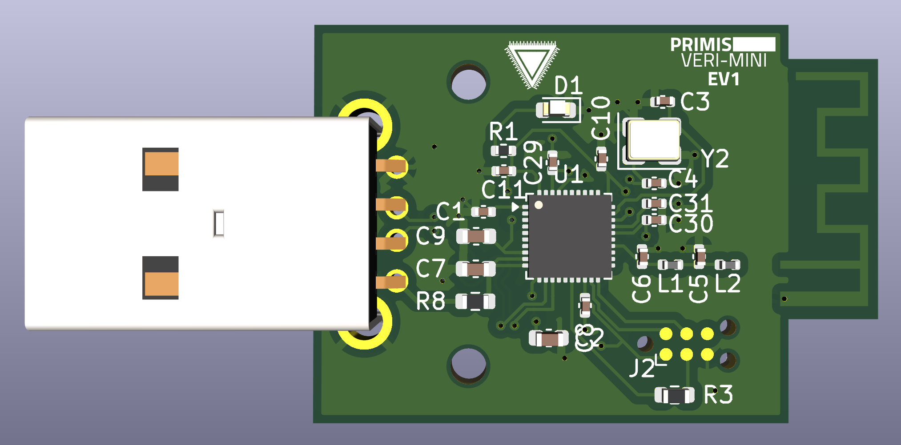
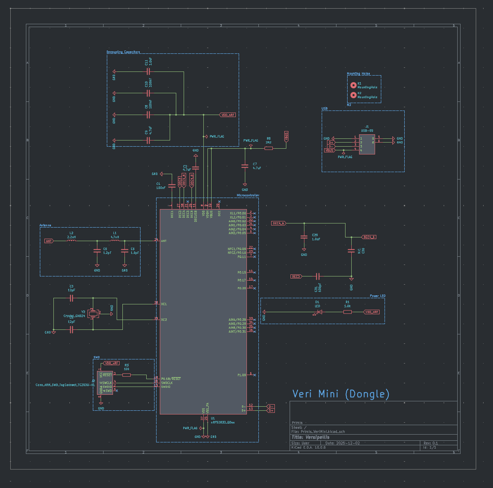
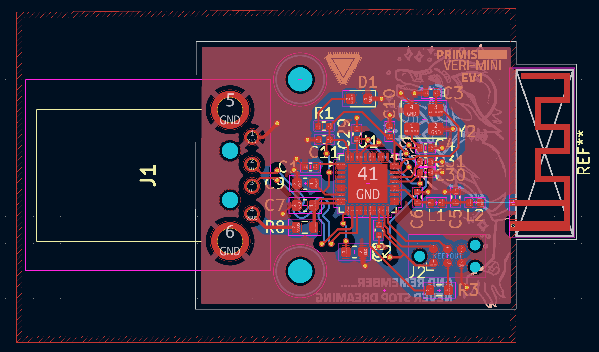

### WARNING
This has yet to be produced by me yet, I have not yet added the gerber files to this repo yet as I have no idea if it will work yet, order them at your own risk.
# VERI-MINI
The general purpose dongle for the Steam Frame but smaller.

  

### Schematics

  

### PCB

  

