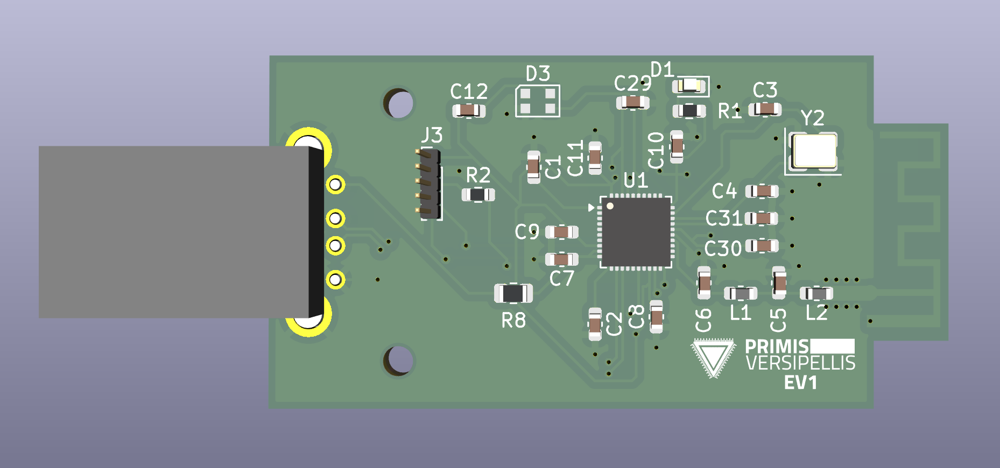
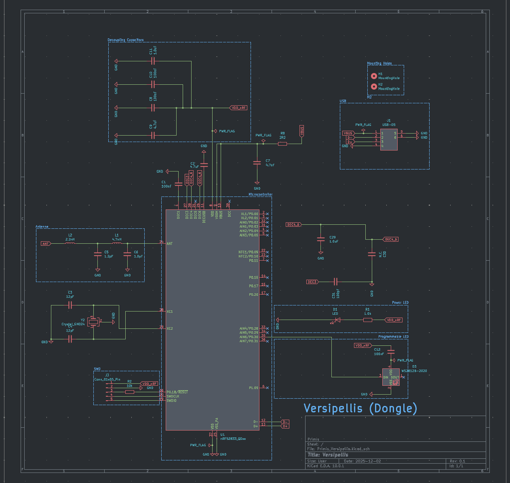
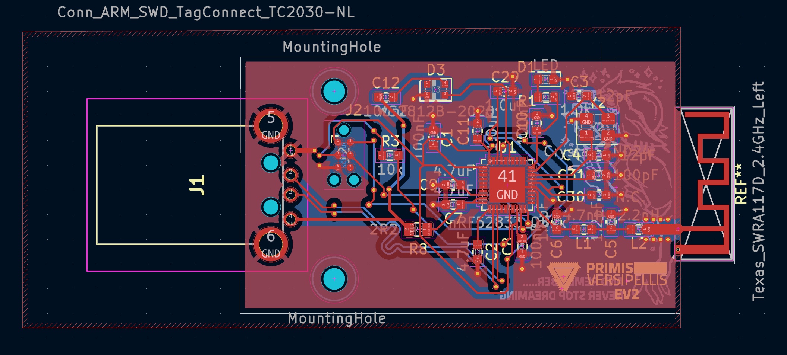
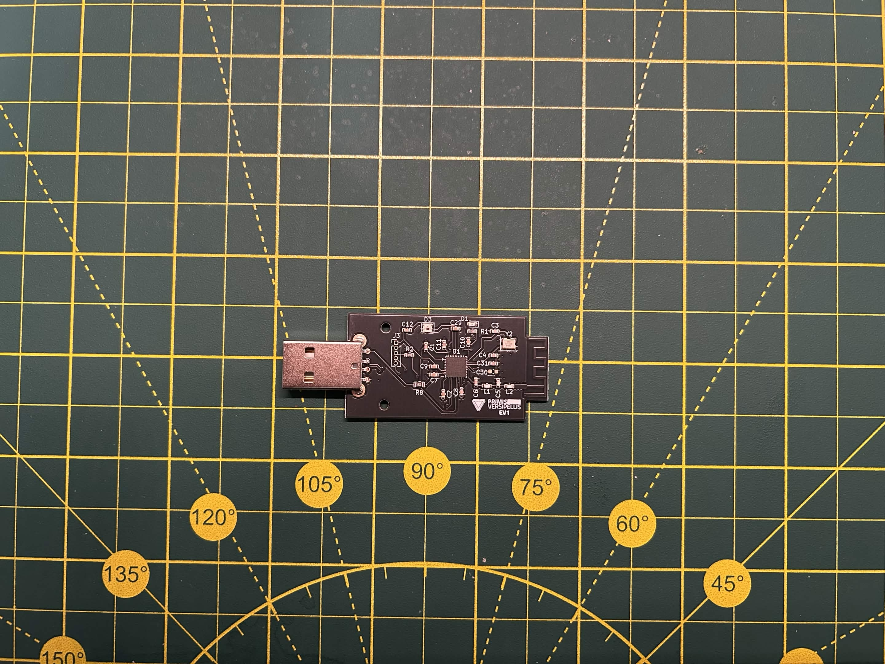

### WARNING
This has yet to be produced by me yet, I have not yet added the gerber files to this repo yet as I have no idea if it will work yet, order them at your own risk.
# Versipellis
The general purpose dongle for the Steam Frame.
## Current Issues
The current version works but I made some mistakes on the clock speeds for the chip. This doesnt seem to effect perforamnce of chip any but Im not sure how it would affect the life time of the chip. Will fix in a future version.

  

### Schematics

  

### PCB

  

### EV1

  

### EV2

  

